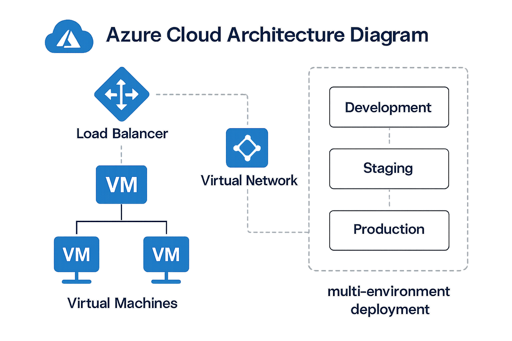

# Automated Web Hosting Solution with Multi-Environment Deployment

[](https://opensource.org/licenses/MIT)
[](https://www.terraform.io/)
[](https://azure.microsoft.com/)

## Project Overview

This project provides an **Infrastructure as Code (IAC)** solution for deploying a robust, scalable web hosting environment on Microsoft Azure. The solution uses Terraform to automate the deployment of virtual machine-based web servers with load balancing capabilities across multiple environments (Development, UAT, and Production).

### Key Features

- **Multi-Environment Support**: Single-click deployment to Dev, UAT, and Production environments
- **Load Balancing**: Azure Load Balancer with backend pool configuration
- **Infrastructure as Code**: Complete Terraform-based infrastructure automation
- **CI/CD Integration**: Azure DevOps pipelines for automated deployment
- **Security**: Network Security Groups, Key Vault integration, and secure access patterns
- **Scalability**: Parameterized deployments with environment-specific configurations
- **Monitoring**: Built-in health checks and monitoring capabilities

## Architecture

The solution deploys the following Azure resources:

- **Virtual Network**: Isolated network environment with subnets
- **Virtual Machines**: Two web server instances for high availability
- **Load Balancer**: Azure Load Balancer with frontend IP and backend pool
- **Network Security Groups**: Firewall rules for secure access
- **Storage Account**: Terraform state management
- **Key Vault**: Secure secrets management
- **Public IP**: External access point for the load balancer

## Prerequisites

Before you begin, ensure you have the following:

### Software Requirements

- [Terraform](https://www.terraform.io/downloads) >= 1.0
- [Azure CLI](https://docs.microsoft.com/en-us/cli/azure/install-azure-cli) >= 2.0
- [Git](https://git-scm.com/downloads)
- [PowerShell](https://docs.microsoft.com/en-us/powershell/scripting/install/installing-powershell) or Bash

### Azure Requirements

- Azure subscription with appropriate permissions
- Azure DevOps organization (for CI/CD)
- Service Principal with Contributor access
- Resource Group creation permissions

### Environment Setup

1. **Clone the repository**:
   ```bash
   git clone https://github.com/your-org/automated-web-hosting-solution.git
   cd automated-web-hosting-solution
   ```

2. **Configure Azure CLI**:
   ```bash
   az login
   az account set --subscription "your-subscription-id"
   ```

3. **Create Service Principal**:
   ```bash
   az ad sp create-for-rbac --name "terraform-sp" --role="Contributor" --scopes="/subscriptions/your-subscription-id"
   ```

## Project Structure

```
automated-web-hosting-solution/
├── README.md                           # This file
├── architecture/                       # Architecture diagrams
│   ├── azure_architecture_diagram.png
│   └── cicd_flow_diagram.png
├── terraform/                          # Terraform configurations
│   ├── main.tf                        # Main Terraform configuration
│   ├── variables.tf                   # Variable definitions
│   ├── outputs.tf                     # Output definitions
│   ├── versions.tf                    # Provider versions
│   
├── environments/                       # Environment-specific configurations
│   ├── dev.tfvars                     # Development environment
│   ├── uat.tfvars                     # UAT environment
│   └── prod.tfvars                    # Production environment
├── scripts/                           # Deployment and utility scripts
│   ├── deploy.ps1                     # PowerShell deployment script
│   ├── deploy.sh                      # Bash deployment script
│   ├── setup-backend.ps1              # Backend setup script
│   └── web-server-setup.sh            # Web server configuration
├── pipelines/                         # Azure DevOps pipelines
│   ├── azure-pipelines.yml           # Main CI/CD pipeline
│   ├── deploy-pipeline.yml           # Deployment pipeline
│   └── destroy-pipeline.yml          # Cleanup pipeline
├── docs/                              # Additional documentation
│   ├── DEPLOYMENT.md                  # Deployment guide
│   ├── CONFIGURATION.md               # Configuration guide
│   └── TROUBLESHOOTING.md             # Troubleshooting guide
└── .gitignore                         # Git ignore file
```

## Quick Start

### 1. Manual Deployment

For manual deployment to a single environment:

```bash
# Navigate to terraform directory
cd terraform

# Initialize Terraform
terraform init

# Plan deployment for development environment
terraform plan -var-file="../environments/dev.tfvars"

# Apply configuration
terraform apply -var-file="../environments/dev.tfvars"
```

### 2. Automated Deployment with Scripts

Use the provided PowerShell script for Windows:

```powershell
# Deploy to development environment
.\scripts\deploy.ps1 -Environment dev -SubscriptionId "your-subscription-id"

# Deploy to UAT environment
.\scripts\deploy.ps1 -Environment uat -SubscriptionId "your-subscription-id"

# Deploy to production environment
.\scripts\deploy.ps1 -Environment prod -SubscriptionId "your-subscription-id"
```

Use the Bash script for Linux/macOS:

```bash
# Deploy to development environment
./scripts/deploy.sh dev your-subscription-id

# Deploy to UAT environment
./scripts/deploy.sh uat your-subscription-id

# Deploy to production environment
./scripts/deploy.sh prod your-subscription-id
```

### 3. CI/CD Pipeline Deployment

1. **Setup Azure DevOps**:
   - Create a new project in Azure DevOps
   - Import this repository
   - Configure service connections

2. **Configure Pipeline Variables**:
   - `ARM_CLIENT_ID`: Service Principal Client ID
   - `ARM_CLIENT_SECRET`: Service Principal Client Secret
   - `ARM_SUBSCRIPTION_ID`: Azure Subscription ID
   - `ARM_TENANT_ID`: Azure Tenant ID

3. **Run Pipeline**:
   - Navigate to Pipelines in Azure DevOps
   - Select the imported pipeline
   - Run the pipeline for desired environment

## Configuration

### Environment Variables

The solution supports the following environment-specific variables:

| Variable | Description | Dev | UAT | Prod |
|----------|-------------|-----|-----|------|
| `location` | Azure region | East US | East US 2 | West US 2 |
| `vm_count` | Number of VMs | 2 | 2 | 3 |
| `vm_size` | VM size | Standard_B2s | Standard_B2ms | Standard_D2s_v3 |
| `environment` | Environment name | dev | uat | prod |

### Terraform Variables

Key Terraform variables in `variables.tf`:

```hcl
variable "environment" {
  description = "Environment name (dev, uat, prod)"
  type        = string
  default     = "dev"
}

variable "location" {
  description = "Azure region"
  type        = string
  default     = "East US"
}

variable "vm_count" {
  description = "Number of web server VMs"
  type        = number
  default     = 2
}

variable "vm_size" {
  description = "Size of the VMs"
  type        = string
  default     = "Standard_B2s"
}
```

## Deployment Environments

### Development Environment

- **Purpose**: Development and testing
- **VM Count**: 2
- **VM Size**: Standard_B2s
- **Load Balancer**: Basic SKU
- **Auto-scaling**: Disabled

### UAT Environment

- **Purpose**: User acceptance testing
- **VM Count**: 2
- **VM Size**: Standard_B2ms
- **Load Balancer**: Standard SKU
- **Auto-scaling**: Enabled

### Production Environment

- **Purpose**: Production workloads
- **VM Count**: 3
- **VM Size**: Standard_D2s_v3
- **Load Balancer**: Standard SKU
- **Auto-scaling**: Enabled
- **High Availability**: Multiple availability zones

## Security

### Network Security

- **Network Security Groups**: Configured with minimal required rules
- **Private Subnets**: VMs deployed in private subnets
- **Load Balancer**: Frontend access only through load balancer
- **SSH Access**: Restricted to bastion host or VPN

### Identity and Access

- **Service Principal**: Least privilege access
- **Key Vault**: Centralized secret management
- **RBAC**: Role-based access control
- **Managed Identity**: Azure AD integration

## Monitoring and Logging

- **Azure Monitor**: VM and application monitoring
- **Log Analytics**: Centralized logging
- **Application Insights**: Application performance monitoring
- **Health Checks**: Load balancer health probes

## Maintenance and Updates

### Terraform State Management

- **Remote State**: Stored in Azure Storage Account
- **State Locking**: Prevented concurrent modifications
- **State Encryption**: Encrypted at rest

### Updates and Patches

- **VM Updates**: Automated patching enabled
- **Application Updates**: Blue-green deployment strategy
- **Infrastructure Updates**: Version-controlled Terraform changes

## Troubleshooting

### Common Issues

1. **Authentication Errors**:
   - Verify service principal credentials
   - Check Azure CLI authentication
   - Validate subscription access

2. **Resource Creation Failures**:
   - Check resource naming conventions
   - Verify subscription quotas
   - Review Azure policy restrictions

3. **Network Connectivity Issues**:
   - Validate NSG rules
   - Check subnet configurations
   - Verify load balancer health probes

### Debugging Commands

```bash
# Check Terraform state
terraform state list

# Validate configuration
terraform validate

# Check resource status
az resource list --resource-group rg-web-hosting-dev

# Test connectivity
curl -I http://your-load-balancer-ip
```

## Contributing

1. Fork the repository
2. Create a feature branch
3. Make your changes
4. Test thoroughly
5. Submit a pull request

### Development Guidelines

- Follow Terraform best practices
- Use meaningful variable names
- Document all modules
- Test in dev environment first
- Update documentation

## License

This project is licensed under the MIT License - see the [LICENSE](LICENSE) file for details.

## Support

- **Issues**: Report issues via GitHub Issues
- **Documentation**: Check the `docs/` directory
- **Community**: Join our discussions in GitHub Discussions

## Acknowledgments

- Microsoft Azure documentation
- Terraform documentation
- Azure DevOps documentation
- Community contributions

---

**Note**: This solution is provided as-is and should be thoroughly tested in your environment before production use. Always follow your organization's security and compliance requirements.
